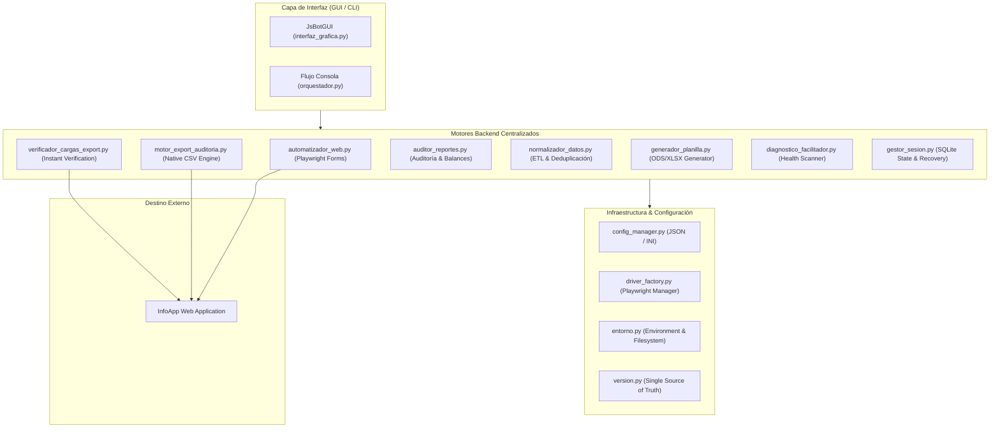

# JSBOT v4.9.0 — Catálogo Integral y Contexto Técnico para IA

> **Documento de Contexto de Arquitectura, Flujos de Usuario y Motor Backend**  
> **Versión Actual**: `v4.9.0`  
> **Entorno de Ejecución**: Windows / Canaima GNU/Linux (Python 3.10+)  
> **Frameworks**: CustomTkinter, Playwright, Requests / Session HTTP, Odfdo, Openpyxl, BeautifulSoup4, SQLite3.

---

## 🏛️ 1. Visión General de Arquitectura

JsBOT es una plataforma modular de automatización, normalización de datos, auditoría masiva y generación documental para la plataforma institucional **InfoApp** de la Fundación Infocentro (Venezuela).



---

## 🖥️ 2. Modos de Lanzamiento

| Modo | Comando / Invocación | Punto de Entrada | Descripción |
|---|---|---|---|
| **Gráfico (Por defecto)** | `python main.py` o `python main.py --gui` | `orquestador.py:iniciar_sistema()` $\to$ `interfaz_grafica.py:JsBotGUI` | Interfaz CustomTkinter en modo oscuro (1020x670) con navegación lateral |
| **Consola (CLI)** | `python main.py --cli` | `orquestador.py:iniciar_sistema()` $\to$ `orquestador.py:flujo_consola()` | Menú interactivo por terminal ANSI para servidores headless o entornos livianos |
| **Lanzador Windows** | `windows.bat` | Batch script nativo | Detecta Python dinámicamente y lanza la app |
| **Lanzador Linux** | `linux.sh` | Shell script nativo | Inyecta `LIBGL_ALWAYS_SOFTWARE=1` para compatibilidad Canaima |

---

## 🧭 3. Inventario Completo de Funciones por Módulo de Usuario (Sidebar)

### 📊 1. Diagnóstico (`Sidebar → Diagnóstico`)
* **Propósito**: Chequeo pre-vuelo de dependencias y compatibilidad del entorno.
* **Acciones**:
  * **Botón "Re-comprobar Entorno"** (`_actualizar_diagnostico_en_caliente`): Re-evalúa SO, versión Python, binarios de navegadores Playwright (Chromium/Firefox/WebKit), suites ofimáticas (LibreOffice/Excel) y directorios requeridos (`logs/`, `data/`, `Planillas/`, `Reportes_Auditoria/`).
  * **Badge de Estado**: Muestra indicador dinámico `[OK] Entorno Óptimo` o `[WARN] Faltan Dependencias`.

---

### 🔐 2. Credenciales (`Sidebar → Credenciales`)
* **Propósito**: Gestión segura y persistencia de accesos a InfoApp.
* **Acciones**:
  * **"Guardar Credenciales"** (`_guardar_credenciales_gui`): Escribe usuario y contraseña en `config/config.ini` bajo secciones `[LOGIN]` y `[CREDENCIALES]`.
  * **"👁 Mostrar / Ocultar"** (`_alternar_ver_clave`): Alterna el enmascarado del campo de clave.
  * **Carga Automática** (`obtener_credenciales`): Al iniciar la vista, puebla automáticamente los campos con los valores existentes.

---

### 📚 3. Formación (`Sidebar → Formación`) — **FLUJO PRINCIPAL A**
* **Propósito**: Carga masiva y automatizada de participantes en cursos y talleres de InfoApp.
* **Flujo de Ejecución**:
  1. **Carga de Archivo** (`_examinar_archivo_formacion`):
     * Acepta `.xlsx`, `.xls`, `.ods`, `.csv`, `.tsv`, `.txt`.
     * Ejecuta pipeline ETL (`normalizador_datos.procesar_archivo_participantes`).
     * Deduplica (`deduplicar_participantes`) y detecta menores sin cédula (`obtener_huerfanos_de_documento`).
     * Muestra tarjeta de pre-vuelo con total de registros válidos, duplicados y huérfanos.
  2. **Acciones Auxiliares**:
     * **"✕ Descartar"** (`_descartar_archivo_formacion`): Limpia memoria y resetea tarjeta.
     * **"Pegar"** (`_pegar_portapapeles_url`): Inserta URL de la actividad copiada en portapapeles.
     * **"👁 Ver Tabla"** (`_abrir_tabla_previsualizacion`): Abre modal interactivo con scroll y visualización de datos parseados.
  3. **Resolución de Huérfanos** (`_mostrar_modal_resolucion_huerfanos`):
     * Modal interactivo que permite al operador: (1) Asignar cédula del representante, (2) Carga de cortesía con documento sintético institucional, o (3) Omitir registro.
  4. **Configuración de Ejecución**:
     * URL de actividad obligatoria (valida patrón `id_activity=\d+`).
     * Checkbox *"Modo Visible"*: Conmuta entre `headless=False` y `headless=True`.
     * Checkbox *"Generar Planilla Oficial .ODS"*: Activa exportación de la lista en formato institucional.
  5. **Disparo Principal**:
     * **"INICIAR CARGA AUTOMATIZADA"** (`_iniciar_ejecucion_asincrona_formacion` $\to$ `_hilo_proceso_carga_formacion`):
       * Inicializa Playwright (`driver_factory.py`).
       * Autentica en InfoApp (`web_utils.realizar_login_infoapp`).
       * Itera lista: busca cédula $\to$ si no existe llena formulario modal $\to$ registra $\to$ valida inserción en tabla.
       * Genera reporte Excel de auditoría (`gestor_sesion.generar_reporte_auditoria_excel`).
       * Genera planilla ODS si estaba marcado (`generador_planilla.generar_planilla_oficial`).
  6. **Resiliencia & Recuperación** (`comprobar_sesion_interrumpida_gui`):
     * Detecta caídas eléctricas o cierres forzados vía SQLite (`data/jsbot.db`).
     * Presenta diálogo para reanudar desde el índice exacto del último participante procesado.

---

### 🏥 4. Servicios (`Sidebar → Servicios`) — **FLUJO PRINCIPAL B**
* **Propósito**: Carga masiva de atenciones comunitarias y servicios prestados.
* **Flujo de Ejecución**:
  1. **Carga y ETL** (`_examinar_archivo_servicios` $\to$ `normalizar_personas_servicios`).
  2. **Configuración**: URL obligatoria con parámetro `id_service=\d+`, selector de tipo de trámite.
  3. **Disparo Principal**:
     * **"INICIAR CARGA DE SERVICIOS"** (`_iniciar_ejecucion_asincrona_servicios` $\to$ `_hilo_proceso_carga_servicios`):
       * Registra cada persona en el servicio (`automatizador_web.registrar_servicio_persona`).
       * Si el usuario no existe en la base central de InfoApp, abre automáticamente el formulario de nuevo usuario (`userform_new`) y completa datos demográficos (`registrar_nuevo_usuario_perfil`).
       * Genera Excel de auditoría de servicios (`generar_reporte_auditoria_servicios`).

---

### 📋 5. Planillas (`Sidebar → Planillas / ODS`)
* **Propósito**: Gestión directa de plantillas y salidas de LibreOffice Calc / Excel.
* **Acciones**:
  * **"Abrir Carpeta de Planillas y Salidas"** (`_abrir_directorio_salidas`): Abre la carpeta local `Planillas/` en el explorador del sistema.
  * **"Inspeccionar Plantilla Base ODS"** (`_abrir_plantilla_base`): Lanza la plantilla `config/plantilla_base.ods` en LibreOffice Calc.
  * **Generación desde InfoApp** (Backend `generador_planilla.generar_planilla_desde_actividad_infoapp`): Descarga los 33 campos demográficos de cualquier actividad existente en InfoApp y llena la planilla oficial sin necesidad de archivo Excel local.

---

### 🔍 6. Auditoría e Inspector (`Sidebar → Reportes`) — **FLUJO PRINCIPAL C**
* **Propósito**: Minería de datos, auditorías de gestión, balances estadísticos e inspección de registros.
* **Modos de Auditoría**:
  1. *Por Facilitador*: Búsqueda por UID de facilitador.
  2. *Por Infocentro*: Búsqueda por código de infocentro.
  3. *Resumen Estadal*: Búsqueda de todo un estado/región para consolidación gerencial.
* **Modos de Extracción**:
  * **Modo Export Nativo (v4.8.0 - Ultrarrápido)**: Usa `motor_export_auditoria.py` vía endpoints CSV delimitados por tubería (`|`). Procesa 40.000+ registros en **~17 segundos** (50x más rápido). Incluye cruce híbrido para actividades con 0 participantes y fallback automático a HTTP Crawler.
  * **Modo Turbo HTTP**: Extracción paralela vía `requests.Session` consumiendo HTML directo.
  * **Modo Playwright**: Rastreo visual guiado por navegador.
* **Perfiles de Credencial**:
  * Conmutador *"Rol Auditor"*: Alterna credenciales regulares vs. credenciales maestras de auditoría configuradas en `[AUDITORIA]`.
* **Disparo**:
  * **"🔍 Iniciar Auditoría"** (`_iniciar_auditoria_thread` $\to$ `auditor_reportes.ejecutar_auditoria`):
    * Valida rango de fechas y parámetros.
    * Extrae Actividades (Formaciones, Productos, Otras Actividades) y Servicios.
    * Ejecuta balance matemático estricto: $\text{Total Actividades} = \text{Formaciones} + \text{Productos} + \text{Otras}$.
    * Realiza agregación por Facilitador con `collections.Counter`.
    * Guarda resultados en memoria y en caché JSON (`scratch/cache_auditoria.json`).
* **Inspección Interactiva (Ventanas Flotantes)**:
  * **"🎓 Formaciones"**: Abre visor de 1100x650 px con búsqueda en tiempo real, ordenamiento por columnas y filtros de actividad.
  * **"🛠️ Servicios"**: Tabla interactiva de atenciones y servicios comunitarios.
  * **"👥 Facilitadores"**: Tabla consolidada de rendimiento por facilitador con métricas clave.
* **Exportación de Resultados**:
  * **"💾 Exportar Reporte..."** (`_accion_exportar_reporte_dialogo`): Permite exportar a **Excel (.xlsx)**, **LibreOffice Writer (.odt)**, **PDF (.pdf)**, **CSV (.csv)** o consola de texto.
  * **"📊 Abrir Reporte"** / **"📂 Reportes"**: Apertura inmediata del documento generado y su carpeta.

---

### ⚙️ 7. Ajustes y Configuración (`Sidebar → Ajustes`)
* **Propósito**: Personalización fina de timeouts y comportamiento del navegador.
* **Controles Persistentes** (`config/settings.json` gestionado por `config_manager.py`):
  * Sliders de Timeout: Login (5–30s), AJAX (5–30s), Elementos DOM (5–30s).
  * Preferencia de Navegador: `chromium`, `firefox`, `webkit`.
  * Switches: Iniciar maximizado, capturas de pantalla automáticas en error, logs detallados de normalización en disco.
  * Valor por defecto: Teléfono institucional para menores de edad sin documento.
  * Botones: *"Guardar Cambios"* y *"Restaurar Valores por Defecto"*.

---

### 💰 8. Créditos (`Sidebar → Créditos`)
* Enlaces directos al portafolio web del desarrollador, Telegram y correo institucional.

---

## 🧩 4. Mapa de Módulos Backend y Servicios Clave

```
jsbot/
├── main.py                          # Launcher inicial y enrutador CLI/GUI
├── orquestador.py                   # Coordinador de inicio y flujos consola
├── config/
│   ├── config.ini                   # Credenciales de usuario y auditor
│   ├── settings.json                # Parámetros operativos y timeouts
│   └── plantilla_base.ods           # Plantilla oficial ODS para asistencias
├── modulos/
│   ├── version.py                   # Fuente única de verdad de versión (v4.8.0)
│   ├── entorno.py                   # Creación de carpetas y verificación de sistema
│   ├── config_manager.py            # Gestor de lectura/escritura de configuración
│   ├── driver_factory.py            # Constructor y administrador de Playwright
│   ├── web_utils.py                 # Login, overlays y utilidades web
│   ├── automatizador_web.py         # Automatización de formularios Playwright
│   ├── motor_export_auditoria.py    # Motor nativo CSV ultra-rápido (v4.8.0)
│   ├── verificador_cargas_export.py # Verificación instantánea post-carga (v4.8.0)
│   ├── diagnostico_facilitador.py   # Escáner de salud de facilitadores (v4.8.0)
│   ├── normalizador_datos.py        # Pipeline ETL, deduplicación y parsing
│   ├── generador_planilla.py        # Generador de planillas ODS/XLSX (v4.8.0)
│   ├── gestor_sesion.py             # Checkpointing SQLite y reportes Excel
│   ├── auditor_reportes.py          # Motor de auditoría, balances y exportación
│   └── interfaz_grafica.py          # Interfaz gráfica CustomTkinter completa
└── tests/                           # Suite de pruebas unitarias y de integración
```

### 🔬 Descripción Detallada de Motores Backend

#### 1. `motor_export_auditoria.py` (v4.8.0)
* **Endpoints de InfoApp**:
  * Actividades: `./pdf/csv_pdo.php?param_csv=SELECT ... FROM reports INNER JOIN participants_list ... &param_sql=true&DB_name=reports` (Delimitador `|`, 46 columnas).
  * Servicios: `./pdf/csv_pdo.php?param_csv=SELECT * from services_users ... &param_sql=true&DB_name=services_users` (Delimitador `|`, 30 columnas).
  * Participantes de Actividad: `../core/app/view/exportxlsx_2.php?param=SELECT * from participants_list where id_activity=... &param_sql=true&filename=participants_list` (33 columnas).
* **Mecanismo Híbrido**: Captura el CSV masivo y complementa desde la vista HTML página 1 para recuperar actividades en borrador o con 0 participantes (ocultas por el `INNER JOIN` de la base de datos).
* **Fallback**: Si la llamada CSV falla por timeout o sesión expirada, se conmuta transparentemente a `consultar_actividades_infoapp_http_crawler`.

#### 2. `verificador_cargas_export.py` (v4.8.0)
* **Funciones Principales**:
  * `verificar_participantes_actividad(session, base_url, id_activity, lista_cedulas)`: Compara una lista de cédulas cargadas contra la base real de la actividad en 0.5s.
  * `obtener_participantes_existentes_actividad(session, base_url, id_activity)`: Extrae cédulas ya registradas para prevenir duplicaciones.
  * `verificar_servicios_cargados_hoy(session, base_url, id_infocentro, fecha)`: Valida qué servicios quedaron asentados en InfoApp.

#### 3. `diagnostico_facilitador.py` (v4.8.0)
* **Función**: `diagnosticar_actividades_facilitador(session, base_url, uid, fecha_inicio, fecha_fin)`.
* **Detección**:
  * Actividades en borrador (0 participantes).
  * Inconsistencias entre fecha de inicio y fin.
  * Actividades de formación clasificadas incorrectamente como "Otras".

#### 4. `generador_planilla.py` (v4.8.0)
* **Funciones**:
  * `generar_planilla_oficial(participantes, metadatos, ruta_salida, formato)`: Llena la plantilla ODS preservando estilos y fórmulas institucionales.
  * `generar_planilla_desde_actividad_infoapp(session, base_url, id_activity, ruta_salida, formato)`: Consulta InfoApp vía `exportxlsx_2.php`, mapea las 33 columnas de cada estudiante a la estructura estándar y genera el `.ods` o `.xlsx`.

#### 5. `automatizador_web.py` & `web_utils.py`
* **Gestión de Formularios Playwright**:
  * `registrar_alumno_playwright`: Manipulación precisa de selects dinámicos (Nacionalidad, Género, Nivel de Instrucción, Estado, Municipio, Parroquia) con esperas explícitas y detección de diálogos modales.
  * `limpiar_overlays`: Eliminación de modales atascados o spinners AJAX en el DOM de InfoApp.
  * `realizar_login_infoapp`: Autenticación con detección inteligente de credenciales incorrectas, redirecciones o sesiones duplicadas.

#### 6. `normalizador_datos.py`
* **Limpieza de Datos**:
  * Limpieza estricta de C.I., teléfonos venezolanos (0414, 0424, 0412, 0416, 0426, 0254), correos y nombres propios.
  * Deduplicación con detección de colisiones de cédula y diferentes nombres.
  * Clasificación automática de participantes mayores vs. menores huérfanos.

---

## 🛡️ 5. Reglas de Mantenimiento para Agentes de IA

1. **Fuente Única de Versión**: Modificar la versión exclusivamente en `modulos/version.py`. La suite de pruebas romperá automáticamente si `settings.json` o los encabezados difieren.
2. **No-Regresión en Playwright**: Nunca alterar los selectores DOM ni la lógica de interacción de formularios probada en `automatizador_web.py` sin validación interactiva previa.
3. **Manejo de Modales Tkinter**: Todo nuevo diálogo modal debe registrarse en `self.modales_activos` y aplicar el protocolo de cierre `WM_DELETE_WINDOW` con `grab_release()`.
4. **Desacoplamiento de Hilos**: Cualquier operación pesada de I/O, red o exportación debe correr en un hilo secundario y comunicar a la UI mediante `cola_eventos` o callbacks protegidos.
5. **Codificación de Archivos**: Mantener codificación UTF-8 estricta en todos los archivos de configuración, logs y reportes.
